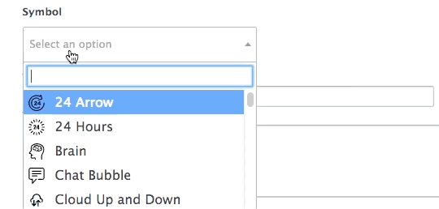
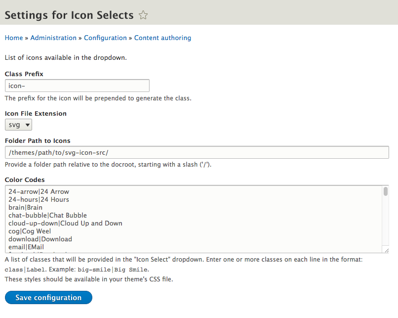

# icon_select_field

Drupal 8 module. Special Dropdown to indicate color of a stripe.

# Usage

After install you will find a new field Type. Use as desired.
Go to the settings page `/admin/config/content/icon_select_field` and add the needed colors.

We normally add the new field named `Icon Select`.
Then in the `field--field-icon-select.html.twig` we put the following:

``` twig
<i class="{{ element['#items'].getString }}"></i>
```

Since you can include SVG files directly in D8 twig, an other way would be like this:

```twig

```

# Demo Screen

When placed into a field, it looks like this:



Backend settings page



# Credits

code base: [github.com/WondrousLLC/icon_select_field](https://github.com/WondrousLLC/icon_select_field/)

developed by [WONDROUS LLC](https://www.wearewondrous.com/)
